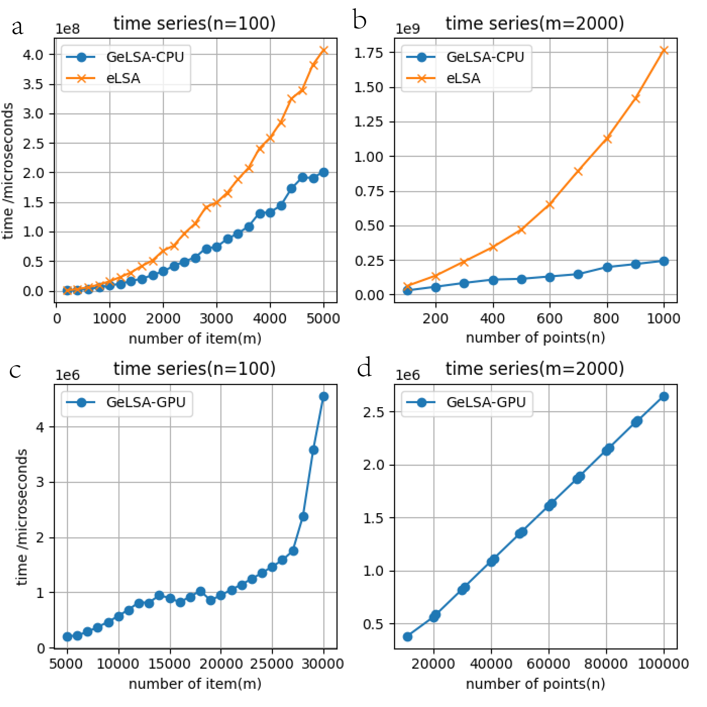
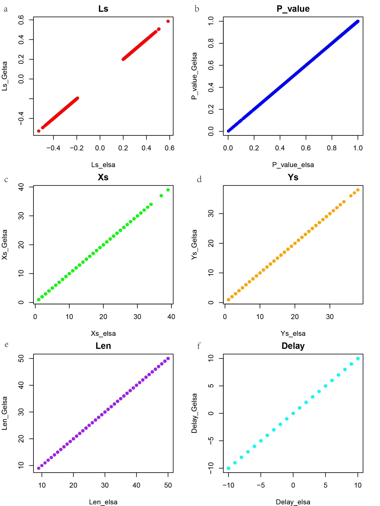

GeLSA: a GPU-accelerated Local Similarity Analysis Software for Time-Series Data Analysis
=========================================================

INSTRODUCTION
--------------

GeLSA (GPU-accelerated extended Local Similarity Analysis) this novel multi-core accelerated computing tool enables local similarity analysis (LSA) for large-scale time series data in microbiome and environmental sciences. Compared to the previous most efficient LSA implementation (eLSA), GeLSA achieved over a 100-fold increase in computational efficiency on GPU machines.This is because GeLSA adapted the max sum subarray dynamical programming algorithm for LSA, allowing efficient core-level parallelisation to use modern CPU/GPU architectures. GeLSA also generally accelerates LSA-derived algorithms, including the local trend analysis (LTA), permutation-based MBBLSA, theory-based DDLSA and STLTA methods.As demonstrated by benchmarks, GeLSA maintained the accuracy of those methods while substantially improving their efficiency. 

METHODS
-------------

Figure 1. We assessed GeLSA’s computational efficiency and found significant improvement. We compared the running time efficiency of GeLSA’s core-level algorithm to that of eLSA on a single CPU core (Fig. 1a). With a fixed series length (n=100), GeLSA’s core algorithm consistently reduced the running time compared to eLSA across dataset sizes ranging from m=200 to m=5000, achieving an average acceleration rate of 1.94, with a variance of only 0.009086.With a fixed number of factors (m=2000) and varying series lengths (n=100 to n=1000), we can clearly observe in (Fig. 1b) that the eLSA computation time curve follows a quadratic pattern, whereas the GeLSA curve remains linear. This indicates that as the time series length increases, the advantage of the improved algorithm becomes more pronounced.

When combining the core-level algorithm with outer-layer parallelization, on an Nvidia RTX 2050 GPU, we observed that the algorithm on the GPU also follows a quadratic pattern. In this context, the traditional eLSA algorithm fails to compute within the given timeframe, while GeLSA significantly improves overall efficiency. This was evident in the tests with m ranging from 5000 to 30000 and a fixed length of n=100. The average computation time did not exceed 10 seconds, while the eLSA algorithm for datasets with fewer time series could easily exceed 100 seconds (Fig. 1c).

Furthermore, for a fixed number of factors (m=2000) and varying time series lengths (n from 10000 to 100000), as shown in (Fig. 1d), we can clearly see that the GeLSA-GPU curve maintains a linear trend. This highlights that as the time series length increases, the benefits of the improved algorithm become even more apparent. The computation time on the GPU consistently stayed below 10 seconds, while eLSA on datasets with 1000 time points took up to 200 seconds.

Figure 2. In Fig. 2, we meticulously assessed GeLSA's accuracy by comparing its results with those obtained from eLSA using the simulation data, including LS (local similarity score), P_value (p-value), Xs (alignment start position of X), Ys (alignment start position of Y), Len (aligned length), and Delay (alignment shift). Each scatter subplot in Fig. 2 demonstrates a diagonal pattern, representing the identity between corresponding variables from GeLSA and eLSA, including LS, P_value, Xs, Ys, Len, and Delay. The fitted lines all had R1 values of 1, except singleton cases due to rounding errors. The near-perfect concordance in all six comparisons provides strong evidence that GeLSA’s results are identical to eLSA's. This level of consistency demonstrates the correctness of GeLSA as an alternative method for performing LSA, ensuring both reliability and accuracy.

Docker
----------------
(1). We provide a convenient multi-core CPU version of the GELSA Docker, which can be used on all computers.
        
        
        docker build -t my-gelsa .          # make the gelsa images
        docker run -it --rm my-gelsa        # Enter the gelsa container for interactive operations.

        # Execute the following commands to test GeLSA.

        lsa_compute test.txt result -d 10 -r 1 -s 20 -p theo            # GeLSA THEO ananlysis
        lsa_compute test.txt result -d 10 -r 1 -s 20 -p ddlsa           # GeLSA DDLSA analysis

        lsa_compute test.txt result -d 10 -r 1 -s 20 -p perm     # GeLSA PERM analysis
        lsa_compute test.txt result -d 10 -r 1 -s 20 -p bblsa    # GeLSA BBLSA analysis

        lsa_compute test.txt result -d 10 -r 1 -s 20 -p theo -T 0.1     # GeLTA THEO analysis
        lsa_compute test.txt result -d 10 -r 1 -s 20 -p stlta -T 0.1    # GeLTA STLTA analysis
        
        lsa_compute test.txt result -d 10 -r 1 -s 20 -p perm -T 0.1     # GeLTA PERM analysis

INSTALL
-----------------
(1). # for use #

Currently, the package is maintained only for Linux (Ubuntu 20.04, 22.04, or 24.04) due to compilation requirements for the core computational components.
Deactivate all virtual environments. This software installation will create a virtual environment named 'gelsa_env', and the software will run within this environment.

To create an lsa package and computate by using cpu

        sudo bash CPU_command.sh   
        source gelsa_env/bin/activate         # Activate the corresponding virtual environment(gelsa_env)    
        lsa_compute test.txt result -d 10 -r 1 -s 20 -p theo    # a test script is available

To create an LSA package with automatic GPU acceleration when available (requires Ubuntu 20.04, 22.04, or 24.04).
And regarding the GPU, the NVIDIA driver version should be as new as possible to ensure the corresponding GPU can be used for computation.
        
        sudo bash GPU_command.sh    
        source gelsa_env/bin/activate         # Activate the corresponding virtual environment(gelsa_env)             
        lsa_compute test.txt result -d 10 -r 1 -s 20 -p theo    # a test script is available

(2). # for development #

GeLSA is open source and your contributions are greatly welcome.

First, use git to fork a copy of gelsa on github.com:
        
        gelsa> git clone ssh://git@github.com/your/gelsa gelsa

Then, make your edits and create a pull request to merge back.

EXECUTABLES
--------------------
The following executable will be available from your python scripts directory (typically already in $PATH).

    lsa_compute                       # for LSA/MBBLSA/DDLSA/LTA/STLTA/PERMUTAION  computation

NOTES
----------------------    
The lsa and lta computation capacities (lsa/lta/permutation) of eLSA and new computation capacities (ddlsa/bblsa/stlta) are available through GeLSA

CONTACT
----------------------
lcxia at scut dot edu dot cn

CITATIONS
----------------------
Please cite the references 1 and 2 if any part of the ELSA python package was used in your study.Please also cite 3 if local trend analysis (LTA) was used in your study. Please also cite the reference 4 and 5 if you used the old LSA R script, which is no loger maintained. Please also cite 6 if Moving Block Bootstrap LSA (MBBLSA) was used in your study. Please also cite 7 if Data-Driven LSA (DDLSA) was used in your study. Please also cite 8 if Steady-state Theory Local Trend Analysis (STLTA) was used in your study. 

1. Li C Xia, Dongmei Ai, Jacob Cram, Jed A Fuhrman, Fengzhu Sun. Efficient Statistical Significance Approximation for Local Association Analysis of High-Throughput Time Series Data. Bioinformatics 2013, 29(2):230-237. (https://doi.org/10.1093/bioinformatics/bts668)
2. Li C Xia, Joshua A Steele, Jacob A Cram, Zoe G Cardon, Sheri L Simmons, Joseph J Vallino, Jed A Fuhrman and Fengzhu Sun. Extended local similarity analysis (eLSA) of microbial community and other time series data with replicates. BMC Systems Biology 2011, 5(S2):S15 (https://doi.org/10.1186/1752-0509-5-S2-S15)
3. Li C Xia, Dongmei Ai, Jacob Cram, Xiaoyi Liang, Jed Fuhrman, Fengzhu Sun. Statistical significance approximation in local trend analysis of high-throughput time-series data using the theory of Markov chains. BMC Bioinformatics 2015, 16, 301 (https://doi.org/10.1186/s12859-015-0732-8)
4. Joshua A Steele, Peter D Countway, Li Xia, Patrick D Vigil, J Michael Beman, Diane Y Kim, Cheryl-Emiliane T Chow, Rohan Sachdeva, Adriane C Jones, Michael S Schwalbach, Julie M Rose, Ian Hewson, Anand Patel, Fengzhu Sun, David A Caron, Jed A Fuhrman. Marine bacterial, archaeal and protistan association networks reveal ecological linkages The ISME Journal 2011, 51414–1425
5. Quansong Ruan, Debojyoti Dutta, Michael S. Schwalbach, Joshua A. Steele, Jed A. Fuhrman and Fengzhu Sun Local similarity analysis reveals unique associations among marine bacterioplankton species and environmental factors Bioinformatics 2006, 22(20):2532-2538
6. Zhang F, Shan A, Luan Y. A novel method to accurately calculate statistical significance of local similarity analysis for high-throughput time series. Stat Appl Genet Mol Biol 2018; 17:20180019. 
7. Zhang F, Sun F, Luan Y. Statistical significance approximation for local similarity analysis of dependent time series data. BMC Bioinformatics 2019;20:53. 
8. Shan A, Zhang F, Luan Y. Efficient approximation of statistical significance in local trend analysis of dependent time series. Front Genet 2022;13:729011
