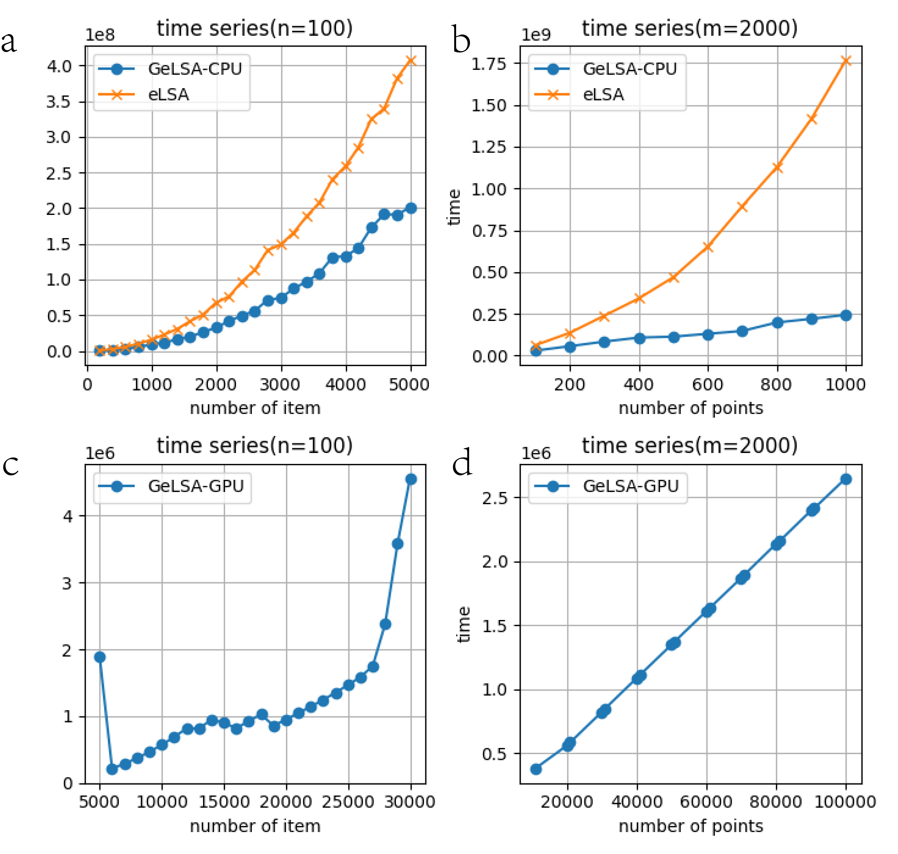
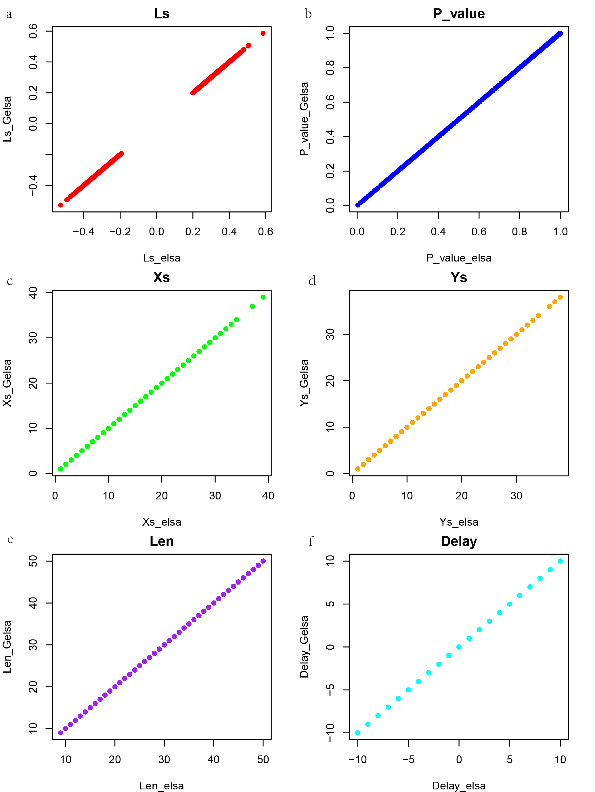

GeLSA: a GPU-accelerated Local Similarity Analysis Tool
=========================================================

INSTRODUCTION
--------------

Understanding the interactions and impacts among factors on ecological or biological systems is essential in biological and environmental sciences. Sequential measurement, as in time series, is an effective way to capture these interactions over time. Traditionally, interesting interactions were primarily detected by using approaches based on the global correlation of pairwise factors over the entire time interval, such as Pearson or Spearman’s correlation. However, real-world biological or environmental data often exhibit more complex interactive relationships and dynamic changes, including local and time-delayed correlations, as observed in various fields such as microbiology, molecular biology, and neuroscience. Consequently, methods based on global similarity analysis may fail to detect these nuanced relationships.

To address the limitations of global correlation methods, local similarity analysis (LSA) has been introduced. LSA is a local alignment method that identifies the best local alignment configuration between two given time series with a maximum delay restriction, thereby detecting local and potentially delayed correlations. Qian et al. initially proposed the LSA method for gene expression analysis, which was later adapted for molecular fingerprint data by Ruan et al. and for metagenomics data by Xia et al. Due to its easy explainability and high effectiveness, LSA has become widely used and highly cited in many areas and has received significant theoretical and practical improvements.  

Significant methodological improvements in LSA include eLSA, a fast C++ implementation and extension of LSA with replicates of data. Later, statistical theories for LSA p-value approximation were developed and added to the eLSA tool. More recent improvements, such as Moving Block Bootstrap LSA (MBBLSA)  and Data-Driven LSA (DDLSA) , were developed for dependent background null models, which are yet to be included in eLSA. A related method is local trend analysis (LTA), identifying such local patterns in direction-of-change series. Significant methodological improvements to LTA include Xia et al.'s theoretical approximation of its statistical significance , recently refined by Shan et al. termed Steady-state Theory Local Trend Analysis (STLTA) for dependent null background , which is yet to be implemented in eLSA.

Recently, we saw a significant expansion in scale and depth of sequencing-based multi-omics time series. This trend has generated an urgent need for more efficient and scalable LSA tools. Before GeLSA, eLSA was the most efficient LSA implementation, allowing pairwise analysis of hundreds to thousands of factors in one day. Specifically, eLSA reaches its daily analytical limit on a personal computer at roughly a hundred factors when the series is short (<20) and permutation is required, and around two thousand factors when the series is long (≥20) and the theoretically approximated p-values could be used. These factor size limits are now routinely challenged as datasets are collected to assess complex biological and environmental systems with high precision. This necessitates the development of faster and more scalable LSA tools.

To address these challenges, we developed GeLSA, a parallel computing tool designed to accelerate the local similarity analysis of time series data. This method leverages the fast-growing multi-core capacity of modern CPUs and GPUs (Rahman & Sakr, 2021; Palleja et al., 2020; Beyer et al., 2021) to optimise the computation process through redesign and parallelisation of the underlying LSA algorithm, significantly reducing the time complexity of computations. By adapting the max sum subarray asslgorithm to LSA, which allows more efficient core-level computing parallelisation, and taking advantage of multi-core architectures, GeLSA significantly improves the analysis efficiency, achieving approximately 144-fold acceleration On nvidia (RTX2050) compared to eLSA. Specifically, GeLSA can now analyse data series ranging from approximately 1,000 to 10,000 data points daily, depending on the length of the series  by using a commonly available GPU-equipped PC, significantly expanding the analytical capacity for real-world tasks. Moreover, GeLSA integrates and accelerates an expanded set of LSA-derived algorithms, including MBBLSA, DDLSA, and STLTA , thus generally enabling more efficient time series analysis under autocorrelated and Markovian backgrounds. Overall, it provides researchers with a powerful tool to uncover dynamic interactions in complex biological and environmental systems. 

METHODS
-------------

Figure 1. The analysis workflow of Local Similarity Analysis (LSA) tools. Users start with raw data (matrices of time series) as input and specify their requirements as parameters. The LSA tools subsequently F-transform and normalize the raw data and then calculate the Local Similarity (LS) Scores and the Pearson’s Correlation Coefficients. The tools then assess the statistical significance (P-values) of these correlation statistics using permutation test and filter out insignificant results. Finally, the tools construct a partially directed association network from significant associations.

Figure 2. Liquid Association / Mediated correlation and example Cytoscape diagrams for all liquid association types of factors X, Y and Z: (A) High Z level enhances the positive correlation between X and Y; (B) Low Z level enhances the negative correlation between X and Y; (C) Low Z level enhances the positive correlation between X and Y; (D) High Z level enhances the negative correlation between X and Y. And (E) A flowchart for incorporating Liquid Association (LA) with Local Similarity (LS) Analysis (LSA). First we use LSA to find candidate local and without time-delayed associations between factors X and Y. The results were filtered based on p-values, q-values and effect (LS score). Then, given the significant LSA factors X and Y, we compute LA score to scout any environmental/OTU factors to discover potential mediating factor Z. Next, a permutation test for liquid association is performed and the results were filtered based on p-values, q-values and effect (LA score) to remove insignificant triplets. Finally, we use the software Cytoscape to visualize the results.

INSTALL
-----------------
(1). # for use #

Currently, the package is maintained only for Linux (Ubuntu) due to compilation requirements for the core computational components.

Firstly, in Linux install the prerequisites: C++ (build-essential), Python(dev).

Then, download and unzip the latest main branch to the gelsa folder.

        gelsa>  bash CPU_command.sh                                                                                     # make lsa package and computate by using cpu
        gelsa>  python in_out_data.py &&  lsa_compute test.txt result -d 10 -r 1 -s 50 -p theo -T 0.1                   # a test script is available

        gelsa>  bash GPU_command.sh                                                                                     # To create an LSA package that can utilize GPU acceleration when available(Ubuntu 22.04 Required)
        gelsa>  python in_out_data.py &&  lsa_compute test.txt result -d 10 -r 1 -s 50 -p theo -T 0.1                   # a test script is available

(2). # for development #

GeLSA is open source and your contributions are greatly welcome.

First, use git to fork a copy of gelsa on github.com:
        
        gelsa> git clone ssh://git@github.com/your/gelsa gelsa

Then, make your edits and create a pull request to merge back.

EXECUTABLES
--------------------
The following executable will be available from your python scripts directory (typically already in $PATH).

    lsa_compute                       # for LSA/MBBLSA/DDLSA/LTA/STLTA/PERMUTAION  computation

NOTES
----------------------    
The lsa and lta computation capacities (lsa/lta/permutation) of eLSA and new computation capacities (ddlsa/bblsa/stlta) are available through GeLSA

CONTACT
----------------------
lcxia at scut dot edu dot cn

CITATIONS
----------------------
Please cite the references 1 and 2 if any part of the ELSA python package was used in your study.Please also cite 3 if local trend analysis (LTA) was used in your study. Please also cite the reference 4 and 5 if you used the old LSA R script, which is no loger maintained. Please also cite 6 if Moving Block Bootstrap LSA (MBBLSA) was used in your study. Please also cite 7 if Data-Driven LSA (DDLSA) was used in your study. Please also cite 8 if Steady-state Theory Local Trend Analysis (STLTA) was used in your study. 

1. Li C Xia, Dongmei Ai, Jacob Cram, Jed A Fuhrman, Fengzhu Sun. Efficient Statistical Significance Approximation for Local Association Analysis of High-Throughput Time Series Data. Bioinformatics 2013, 29(2):230-237. (https://doi.org/10.1093/bioinformatics/bts668)
2. Li C Xia, Joshua A Steele, Jacob A Cram, Zoe G Cardon, Sheri L Simmons, Joseph J Vallino, Jed A Fuhrman and Fengzhu Sun. Extended local similarity analysis (eLSA) of microbial community and other time series data with replicates. BMC Systems Biology 2011, 5(S2):S15 (https://doi.org/10.1186/1752-0509-5-S2-S15)
3. Li C Xia, Dongmei Ai, Jacob Cram, Xiaoyi Liang, Jed Fuhrman, Fengzhu Sun. Statistical significance approximation in local trend analysis of high-throughput time-series data using the theory of Markov chains. BMC Bioinformatics 2015, 16, 301 (https://doi.org/10.1186/s12859-015-0732-8)
4. Joshua A Steele, Peter D Countway, Li Xia, Patrick D Vigil, J Michael Beman, Diane Y Kim, Cheryl-Emiliane T Chow, Rohan Sachdeva, Adriane C Jones, Michael S Schwalbach, Julie M Rose, Ian Hewson, Anand Patel, Fengzhu Sun, David A Caron, Jed A Fuhrman. Marine bacterial, archaeal and protistan association networks reveal ecological linkages The ISME Journal 2011, 51414–1425
5. Quansong Ruan, Debojyoti Dutta, Michael S. Schwalbach, Joshua A. Steele, Jed A. Fuhrman and Fengzhu Sun Local similarity analysis reveals unique associations among marine bacterioplankton species and environmental factors Bioinformatics 2006, 22(20):2532-2538

6.Zhang F, Shan A, Luan Y. A novel method to accurately calculate statistical significance of local similarity analysis for high-throughput time series. Stat Appl Genet Mol Biol 2018; 17:20180019. 

7.Zhang F, Sun F, Luan Y. Statistical significance approximation for local similarity analysis of dependent time series data. BMC Bioinformatics 2019;20:53. 

8.Shan A, Zhang F, Luan Y. Efficient approximation of statistical significance in local trend analysis of dependent time series. Front Genet 2022;13:729011
